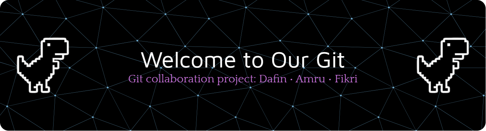

###

  
  
  

<picture>
  <source media="(prefers-color-scheme: dark)" srcset="https://raw.githubusercontent.com/Dafin1723/Dafin1723/output/pacman-contribution-graph-dark.svg">
  <source media="(prefers-color-scheme: light)" srcset="https://raw.githubusercontent.com/Dafin1723/Dafin1723/output/pacman-contribution-graph.svg">
  
</picture>

###

<h1 align="center">hey there 👋</h1>

###

## 👥 THE FOOL
Tentang Kami

THE FOOL adalah kelompok yang beranggotakan tiga orang:

Dafin
Fikri
Amru

Kelompok ini dibentuk untuk mengerjakan proyek magang dari Gamelab, sekaligus menjadi wadah belajar, latihan, dan kolaborasi selama proses magang berlangsung.

Repository ini digunakan sebagai tempat menyimpan hasil latihan, eksperimen, dan pengembangan proyek yang kami kerjakan bersama.

## 📚 Latar Belakang Training

Sebelum masuk ke pengerjaan proyek utama, kami telah menjalani training selama 3 minggu dengan materi dasar yang menjadi fondasi kami, yaitu:

Python Basic sebagai dasar pemrograman

Git & Git Collaboration untuk mengatur versi kode dan kerja tim

Training ini membantu kami memahami cara menulis kode yang lebih terstruktur, bekerja secara kolaboratif, dan membiasakan diri dengan workflow pengembangan yang rapi.

## 🃏 Arti Nama Kelompok: THE FOOL

Nama THE FOOL terinspirasi dari donghua Lord of the Mysteries (LOTM).
Bagi kami, The Fool bukan sekadar “si bodoh”, tapi simbol dari seseorang yang berada di awal perjalanan.

The Fool melambangkan:
Awal yang kosong, tapi penuh potensi
Keberanian untuk belajar dari nol
Kesediaan untuk mencoba, gagal, lalu berkembang

Sebagai peserta magang, kami sadar bahwa kami masih di tahap belajar. Nama THE FOOL mengingatkan kami untuk tetap rendah hati, terbuka terhadap ilmu baru, dan terus berkembang seiring proses yang dijalani.

## 🎯 Tujuan Kelompok

Melalui proyek magang ini, kami memiliki beberapa tujuan utama:

Mengembangkan kemampuan pemrograman, khususnya Python
Membiasakan kerja tim menggunakan Git
Menerapkan ilmu training ke dalam proyek nyata
Melatih tanggung jawab dan konsistensi dalam menyelesaikan tugas

## 🔧 Tentang Repository Ini

Repository ini berfungsi sebagai:

Media kolaborasi antar anggota tim
Tempat menyimpan hasil latihan dan proyek
Dokumentasi progres selama magang di Gamelab

###

  
  
  
  
  
  
  
  
  
  
  
  
  

###

## Team Stats

## 🏆 Team Contribution Stats

| Member | Commits | Last Commit |
|--------|--------|------------|
| Dafin  | 16     | 30 Jan 2026 |
| Fikri  | 0      | 31 Jan 2026 |
| Amru   | 9      | 30 Jan 2026 |

###

---

# Branch Description

Those branch is just to separate between contributing person.

Branch di project ini hanya untuk memisahkan kontribusi per orang.
